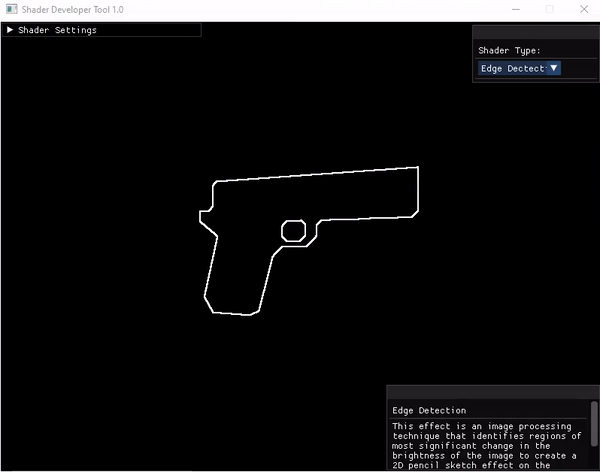

# Shader-Developer-Tool
### Description:
The Shader Developer Tool is a program developed in OpenGl using the C++ Language to showcase different shaders with in-depth explanations for each shader used in the program. This tool uses the ImGUI library developed by Ocornut to allow for user interaction and navigation of the program. The user can change the skybox and the mesh displayed in the program, the user can also change the shader being used at run-time. 

#### Shaders Used:
* Blinn-Thong Model
* Blinn-Thong Spotlight
* Surface Animation
* Night Vision
* Edge Detection
* Wireframe

### Installation Guide:
1.	Download “Shader-Developer-Tool.zip”
2.	Unzip the folder onto your desktop.
3.	To run the build, go on Project_Template/x64/Release and run “Project_Template.exe”
4.	To open the project solution, Project_Template folder and run “project_Template.sln”

### Credits:
* Pistol Model: https://sketchfab.com/3d-models/1911-low-poly-pixel-texture-f88f9c2603b24c4ea97270639fe29cb4
* Car Model: https://sketchfab.com/3d-models/low-poly-compact-car-with-pixel-art-texture-c8b6f9d0903f456a8d633fd4ab711c9d
*	R2-D2 Model: https://www.turbosquid.com/3d-models/3d-model-of-ultra-r2-d2-r2/1001640
